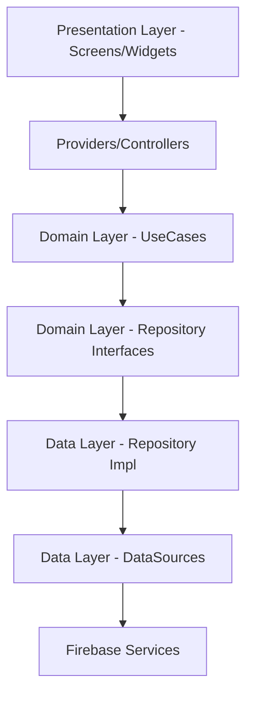

# 🌊 PresUnivGo — Exclusive Professional Networking for President University

[](https://flutter.dev)
[](https://firebase.google.com)
[](https://dart.dev)
[](https://opensource.org/licenses/MIT)

**PresUnivGo** is a high-fidelity, professional networking platform tailored specifically for the **President University** community. Built with Flutter and powered by Firebase, it bridges the gap between students, alumni, and faculty through real-time interactions, career tracking, and community engagement.

🚀 **Live Demo:** [https://puconnect-9e8fb.web.app](https://puconnect-9e8fb.web.app)

---

## ✨ Key Features

### 💎 Premium Experience
- **Dark Teal & Cream Aesthetic**: A custom-designed UI that reflects professionalism and campus identity.
- **Wave Interaction UI**: Modern, fluid onboarding and login flows using custom Bezier curves.
- **Fluid Animations**: Smooth transitions powered by `flutter_animate` for a premium app feel.

### 👥 Professional Networking
- **Real-Time Feed**: Share updates, images, and insights with the campus community.
- **Story System**: Visual status updates with real-time image uploads to Firebase Storage.
- **Deep Profile Sync**: Track and showcase Professional Experience, Education, and Skills with dynamic Firestore synchronization.
- **Messaging**: Instant real-time chat with fellow students and alumni.

### 🎓 Campus Ecosystem
- **Student Clubs**: Create and join departmental clubs with dedicated interaction channels.
- **Job Marketplace**: A professional portal for campus-exclusive internships and job opportunities.
- **Faculty/Major Logic**: Intelligent hierarchical selection for all President University faculties.

---

## 🛠️ Technology Stack

- **Frontend**: Flutter (3.24.x)
- **State Management**: Riverpod (High-performance provider system)
- **Backend**: Firebase (Auth, Firestore, Storage, Hosting)
- **Design**: Material 3 + Custom Glassmorphism & Wave UI
- **Architecture**: Clean Architecture (Domain, Data, Presentation layers)

---

## 🏗️ Technical Architecture

PresUnivGo follows strict **Clean Architecture** principles to ensure maintainability and scalability:



- **Domain Layer**: Contains pure business logic and entities.
- **Data Layer**: Handles data mapping (Models) and external service communication (Firestore/Storage).
- **Presentation Layer**: Functional UI components and state management with Riverpod.

---

## 📸 Screenshots

| Login UI | Home Feed | Profile Details |
| :---: | :---: | :---: |
|  |  |  |

---

## 🚀 Getting Started

### Prerequisites
- Flutter SDK (latest stable)
- Firebase Account & Project
- Git

### Installation

1. **Clone the repository**
   ```bash
   git clone https://github.com/wi5nuu/presunivgo.git
   cd presunivgo
   ```

2. **Install dependencies**
   ```bash
   flutter pub get
   ```

3. **Firebase Setup**
   - Initialize Firebase using `flutterfire configure`.
   - Ensure `lib/firebase_options.dart` is generated.

4. **Run the app**
   ```bash
   flutter run
   ```

---

## 📜 License
Published under the **MIT License**. Created by **Wisnu Ashar** for Wireless and Mobile Programming Final Project (FINPROTION).

---

Developed with ❤️ at President University.
